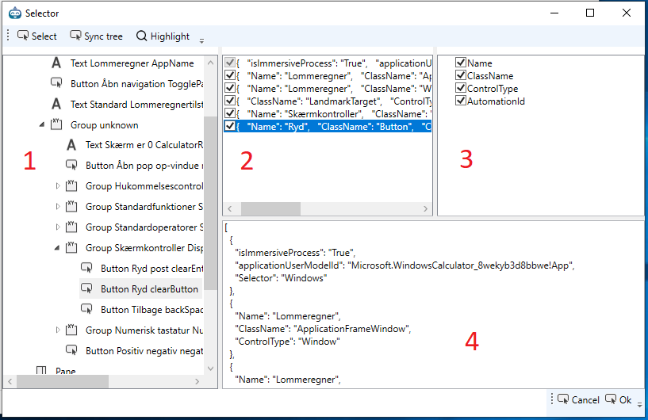
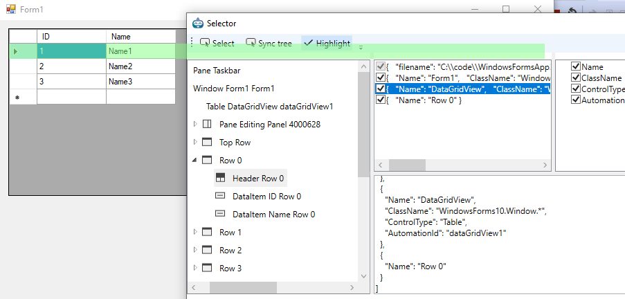
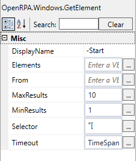
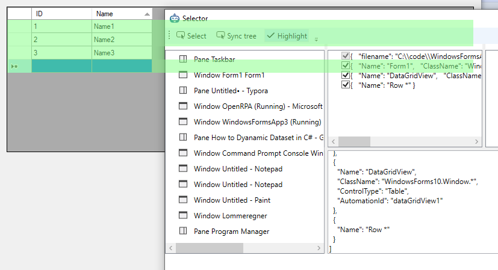
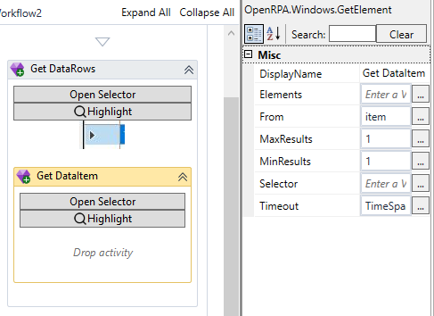
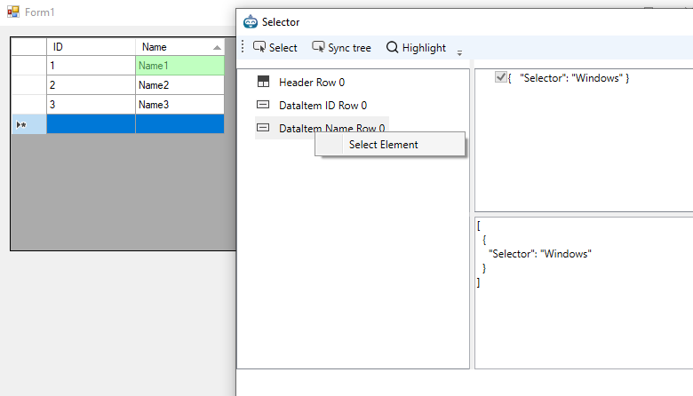
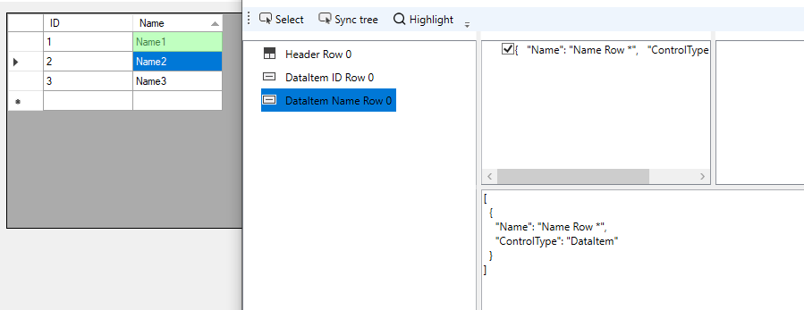
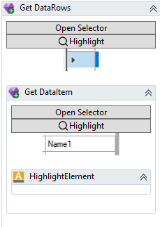
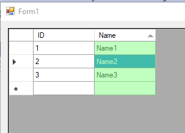

Selector window

The window consists of 4 areas. Number 1 on the left represent what is visible right now, 2,3 and 4 is for manipulating the selector, and does not need to be visible

1) Is the UI tree representing what is visible right now

2) Is each element selector in the selector

3) represent each element property selector in the selected selector item

4) is a JSON representation of the current selector

You are free to change the selector in both window 2, 3 and 4 and all changes should be reflect in all 3 windows simultaneously. 

When a selector is created it will try and "guess" what is the minimum required properties to find the object ( minimize the amount of properties needed) you can broaden the "hit rate" by adding more selectors and/or implement pattern matching in the selector. Per default a selector will do an exact match per property, but by using ? and * characters you can broaden your hits, for instance if you selected a DataRow.

First ensure you enable selector more than 1 row by increasing MaxResults

You could change the selector to allow any name starting with Row but replacing 0 with a start *

Now you can start "picking out" fields in the datarow, using a nested GetElement and setting From to Item

Now open the Selector for the nested item, you will see the UI tree is restricted to the anchor, if multiple hits exists, it will show the first found item.
We want to create a selector that finds a child element, that should work on all hits from the parent, so we need to strip out any identifiers that would be different.

Lets get Name, right click "DataItem Name Row 0" and choose Select Element.

Then replace zero with a star * in the selector 

To test the result, add a highlight activity in the nested GetElement and press Play

Now, lets get the value, also, add a WriteLine under Highlight and set Text to item.Value

